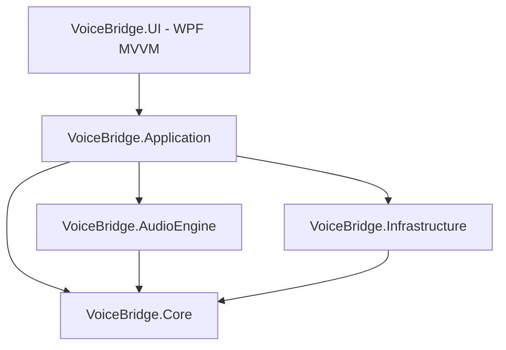
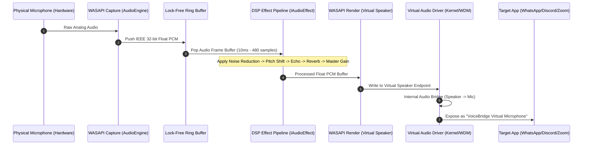

# ARCHITECTURE.md — VoiceBridge System Architecture & Layered Specification

## 1. Architecture Overview
VoiceBridge is structured as a modular, layered .NET 8 WPF application adhering to **Clean Architecture** principles. The application isolates low-level Windows Audio Session API (WASAPI) hardware communication, real-time Digital Signal Processing (DSP) mathematical algorithms, application orchestration, and the WPF MVVM presentation layer.



---

## 2. Audio Processing Topology

The real-time audio pipeline captures raw PCM audio from a physical microphone, processes sample buffers through a chain of DSP effect filters, and writes the modified PCM audio into a virtual audio device's input render stream.



---

## 3. Project Layering & Directory Breakdown

```
VoiceBridge/
├── src/
│   ├── VoiceBridge.Core/
│   │   ├── Entities/               # AudioDevice, VoicePreset, AudioFormat
│   │   ├── Enums/                  # EngineState, EffectType, DeviceType, DriverStatus
│   │   ├── Interfaces/             # IAudioEffect, IAudioPipeline, IAudioDeviceService, etc.
│   │   └── Models/                 # AudioFrame, MeterData, ProcessResult
│   │
│   ├── VoiceBridge.AudioEngine/
│   │   ├── Capture/                # WasapiCaptureService, RingBuffer
│   │   ├── Render/                 # WasapiRenderService
│   │   ├── Pipeline/               # AudioPipelineHost, EffectChain
│   │   ├── Effects/                # PitchShiftEffect, ReverbEffect, EchoEffect, RobotEffect
│   │   └── Resampling/             # WdlResampler / SoundTouch Interop / SampleRateConverter
│   │
│   ├── VoiceBridge.Infrastructure/
│   │   ├── AudioDevices/           # WasapiDeviceEnumerator, DeviceWatcher
│   │   ├── Driver/                 # VirtualAudioDriverDetector, DriverInstallerService
│   │   ├── Configuration/          # AppSettingsRepository, PresetRepository
│   │   └── Logging/                # SerilogConfiguration
│   │
│   ├── VoiceBridge.Application/
│   │   ├── Services/               # ApplicationStateService, AudioEngineFacade
│   │   ├── Presets/                # PresetManager
│   │   └── Dtos/                   # DeviceDto, PresetDto, EffectConfigDto
│   │
│   └── VoiceBridge.UI/
│       ├── ViewModels/             # MainViewModel, DashboardViewModel, AudioDeviceViewModel, EffectsViewModel
│       ├── Views/                  # MainWindow.xaml, DashboardView.xaml, PresetLibraryView.xaml
│       ├── Controls/               # VuMeterControl.xaml, CustomSlider.xaml, PitchCard.xaml
│       ├── Converters/             # BooleanToVisibilityConverter, LatencyToColorConverter
│       └── Resources/              # Colors.xaml, Styles.xaml, Fonts/
```

---

## 4. Core Interface Specifications

### 4.1 Audio Effect Interface (`IAudioEffect`)
All real-time audio filters must implement the lock-free, zero-allocation `IAudioEffect` contract:

```csharp
namespace VoiceBridge.Core.Interfaces
{
    public interface IAudioEffect
    {
        string Id { get; }
        string Name { get; }
        EffectType Type { get; }
        bool IsEnabled { get; set; }

        /// <summary>
        /// Processes sample buffer in-place or from input to output buffer.
        /// Must be thread-safe, allocation-free, and non-blocking.
        /// </summary>
        /// <param name="buffer">IEEE 32-bit float audio buffer [-1.0f, +1.0f]</param>
        /// <param name="offset">Start sample index</param>
        /// <param name="count">Total samples to process (channels * frame count)</param>
        /// <param name="sampleRate">Current audio engine sample rate (e.g., 48000 Hz)</param>
        /// <param name="channels">Channel count (1 = Mono, 2 = Stereo)</param>
        void Process(float[] buffer, int offset, int count, int sampleRate, int channels);

        /// <summary>
        /// Resets internal delay lines, accumulators, or state buffers.
        /// </summary>
        void ResetState();
    }
}
```

### 4.2 Audio Device Service (`IAudioDeviceService`)
```csharp
namespace VoiceBridge.Core.Interfaces
{
    public interface IAudioDeviceService
    {
        IEnumerable<AudioDevice> GetInputDevices();
        IEnumerable<AudioDevice> GetOutputDevices();
        AudioDevice GetDefaultInputDevice();
        AudioDevice GetVirtualMicrophoneDevice();
        event EventHandler<DeviceListChangedEventArgs> DeviceListChanged;
    }
}
```

### 4.3 Audio Pipeline Engine (`IAudioPipelineHost`)
```csharp
namespace VoiceBridge.Core.Interfaces
{
    public interface IAudioPipelineHost
    {
        EngineState CurrentState { get; }
        double CurrentLatencyMs { get; }
        float PeakLevelLeft { get; }
        float PeakLevelRight { get; }

        void Initialize(AudioDevice inputDevice, AudioDevice virtualOutputDevice, AudioDevice monitorDevice = null);
        void Start();
        void Stop();
        void AddEffect(IAudioEffect effect);
        void RemoveEffect(string effectId);
        event EventHandler<MeterDataEventArgs> MeterDataUpdated;
        event EventHandler<EngineErrorEventArgs> EngineErrorOccurred;
    }
}
```

### 4.4 Virtual Driver Service (`IVirtualAudioDriverService`)
```csharp
namespace VoiceBridge.Core.Interfaces
{
    public interface IVirtualAudioDriverService
    {
        bool IsDriverInstalled { get; }
        DriverStatus CheckStatus();
        Task<bool> InstallDriverAsync();
        Task<bool> UninstallDriverAsync();
    }
}
```

---

## 5. Threading & Concurrency Model

Audio processing requires real-time deterministic performance. Standard memory allocations or lock contention on the audio thread will cause audio stuttering (dropouts/clicks).

1. **Audio Thread (Priority: `ThreadPriority.Highest`):**
   - Direct WASAPI event callback thread.
   - Operates strictly on pre-allocated `float[]` buffers.
   - Zero `GC.Collect()` triggers, zero heap allocations during runtime processing.
   - Reads/writes parameters using `volatile` atomic primitives or thread-safe lock-free memory swaps.

2. **UI Thread (WPF Dispatcher):**
   - Binds to `INotifyPropertyChanged` ViewModel properties.
   - Receives throttled metering data via `MeterDataUpdated` event dispatched at `25 Hz` (40ms interval) to keep CPU overhead minimal while maintaining smooth UI rendering.

3. **Background Worker Threads:**
   - Asynchronous device enumeration, configuration saving, driver installation processes.

---

## 6. Dependency Injection & Service Registration

The application uses `Microsoft.Extensions.DependencyInjection` in `App.xaml.cs`:

```csharp
public static IServiceProvider ConfigureServices()
{
    var services = new ServiceCollection();

    // Infrastructure & System Services
    services.AddSingleton<IVirtualAudioDriverService, VirtualAudioDriverService>();
    services.AddSingleton<IAudioDeviceService, WasapiDeviceService>();
    services.AddSingleton<IPresetRepository, JsonPresetRepository>();
    services.AddSingleton<IAppSettingsRepository, AppSettingsRepository>();

    // Audio Engine
    services.AddSingleton<IAudioPipelineHost, AudioPipelineHost>();
    services.AddTransient<PitchShiftEffect>();
    services.AddTransient<ReverbEffect>();
    services.AddTransient<EchoEffect>();
    services.AddTransient<RobotEffect>();

    // Application Layer
    services.AddSingleton<IApplicationStateService, ApplicationStateService>();
    services.AddSingleton<IPresetManager, PresetManager>();

    // ViewModels
    services.AddSingleton<MainViewModel>();
    services.AddSingleton<DashboardViewModel>();
    services.AddSingleton<PresetLibraryViewModel>();
    services.AddSingleton<SettingsViewModel>();

    return services.BuildServiceProvider();
}
```
