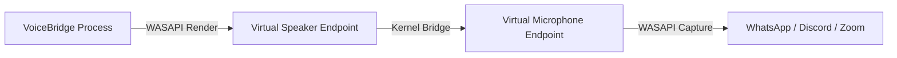

# TECHNICAL_RISKS.md — Technical Risks & Architectural Feasibility Analysis

## 1. Executive Summary
The primary engineering challenge in building **VoiceBridge** is not the UI or basic audio recording, but rather **exposing processed real-time audio as a system-recognized Virtual Microphone** on modern 64-bit Windows (Windows 10/11), while maintaining **sub-50ms processing latency**.

This document analyzes the core technical risks, Windows kernel audio limitations, DSP algorithmic trade-offs, driver licensing, and mitigation strategies.

---

## 2. Virtual Microphone Feasibility & Driver Architecture

### 2.1 The Windows Core Audio Limitation
Windows Core Audio (WASAPI / MMDevice API) provides APIs to **capture** from existing input devices and **render** to existing output devices. However, **user-mode applications cannot dynamically register new audio input endpoints** without a Kernel-Mode Audio Driver (WDM / PortCls or AVStream driver).

```
[ Normal User App ] ---> WASAPI ---> Cannot create new System Endpoint!
[ Virtual Audio Driver (Kernel) ] ---> Exposes System Endpoint: "VoiceBridge Virtual Microphone"
```

### 2.2 Driver Feasibility Evaluation

| Driver Approach | Technical Mechanism | Driver Signing Requirement | Licensing | Feasibility for VoiceBridge |
|---|---|---|---|---|
| **From-Scratch WDK Kernel Driver** | Custom C/C++ WDM PortCls adapter driver | Requires WHQL Attestation & EV Code Signing Certificate ($300+/yr + LLC) | First-party | ❌ Low (Multi-month driver dev cycle, risk of BSOD) |
| **MIT Open-Source Virtual Driver (`Virtual-Audio-Driver`)** | WDM Virtual Speaker + Virtual Mic pair | Pre-compiled or test-signed WDK driver | MIT License | **✅ Recommended Primary Strategy** |
| **VB-Audio Virtual Cable (Integration)** | Commercial virtual audio loopback driver | Officially WHQL Signed by Microsoft | Freeware / Redistribution License Required | **✅ Feasible Fallback Strategy** |

### 2.3 Audio Routing Architecture
VoiceBridge utilizes the **Virtual Speaker -> Virtual Microphone Bridge** pattern:



1. VoiceBridge renders its processed audio to the driver's **Virtual Speaker** playback device.
2. The Kernel driver internally bridges the audio buffer from its Virtual Speaker to its paired **Virtual Microphone** capture device.
3. Target applications (Discord, Zoom, WhatsApp) select the Virtual Microphone as their standard audio input.

---

## 3. Real-Time DSP Algorithmic Complexity & Latency Budget

### 3.1 Pitch Shifting Algorithm Selection

| Algorithm | Processing Domain | Quality | Latency | CPU Usage | Selection |
|---|---|---|---|---|---|
| **Phase Vocoder (STFT/FFT)** | Frequency Domain | High (Smooth pitch) | High (30 - 80ms delay due to FFT windowing) | High | ⚠️ Secondary (High quality mode) |
| **WSOLA (Waveform Similarity Overlap-Add)** | Time Domain | Good (Speech tuned) | Low (10 - 20ms window) | Low | **✅ Primary Choice for Real-Time** |
| **Simple Resampling (Speed Up/Slow Down)** | Time Domain | Poor (Chipmunk/Slow motion effect) | Very Low (< 2ms) | Negligible | ❌ Rejected (Changes audio duration) |

### 3.2 End-to-End Latency Budget Target (< 50ms)

```
[ Physical Mic Capture ]  ---> 10.0 ms  (WASAPI Shared Event Buffer)
[ Lock-Free Ring Buffer]  --->  2.5 ms  (Queue Margin)
[ WSOLA Pitch DSP ]       ---> 15.0 ms  (Processing Frame Window)
[ Reverb / Echo Filter ]  --->  2.5 ms  (In-place Float Array Math)
[ WASAPI Virtual Render]  ---> 10.0 ms  (Render Buffer)
[ Kernel Bridge ]         --->  5.0 ms  (Driver Audio Transport)
-------------------------------------------------------------------
TOTAL ESTIMATED LATENCY   ---> 45.0 ms  (Perceptible latency threshold: 50ms)
```

---

## 4. Concurrency, GC Pauses & Buffer Underrun Mitigation

### 4.1 Preventing .NET Garbage Collection Stutter
In standard C# applications, automatic Garbage Collection (GC) pauses the execution threads for several milliseconds. If a GC pause occurs on the WASAPI audio capture thread, a **buffer underrun** occurs, causing audible audio clicks, pops, or distortion.

**Mitigation Rules:**
1. **Zero Allocations on Audio Path:** No `new` object allocations inside the `Process()` audio loop.
2. **Pre-allocated Memory:** Pre-allocate all float buffers (`float[]`), lookup tables, and delay line arrays during initialization.
3. **Lock-Free Structs:** Use `Volatile.Read` / `Volatile.Write` for UI parameter updates instead of `lock(object)` locks to eliminate thread contention.

---

## 5. Hardware Disconnection & System Resilience

### 5.1 Physical Microphone Disconnect
- **Risk:** User unplugs USB headset while audio engine is running.
- **Impact:** WASAPI capture raises `AUDCLNT_E_DEVICE_INVALIDATED` exception.
- **Mitigation:**
  1. Catch WASAPI device invalidation exceptions cleanly.
  2. Transition engine to `EngineState.Paused`.
  3. Notify UI via event; prompt user or automatically fall back to the default Windows microphone device.

### 5.2 Sample Rate & Resampling Mismatches
- **Risk:** Physical Mic runs at `44,100 Hz` (CD quality), while Virtual Microphone runs at `48,000 Hz` (Studio quality).
- **Mitigation:**
  1. Detect input and output sample rates during initialization.
  2. Instantiate an inline high-quality resampler (e.g. `WdlResampler` or NAudio `MediaFoundationResampler`) when rates differ.

---

## 6. Target Application Compatibility Matrix

| Target Application | Supported Input Device Type | Exclusive Mode Requirement | Notes |
|---|---|---|---|
| **WhatsApp Desktop** | Standard Windows Multimedia Device | No (Shared Mode) | Works seamlessly with Virtual Mic |
| **Discord** | Standard WASAPI / DirectSound | No (Shared Mode) | User selects "VoiceBridge Virtual Mic" in Voice Settings |
| **Zoom Communications** | Standard Windows Audio Device | No (Shared Mode) | Supports automatic gain control (can be disabled) |
| **Microsoft Teams** | Standard Windows Multimedia Device | No (Shared Mode) | Fully compatible |
| **OBS Studio** | WASAPI Capture / DirectSound | No (Shared Mode) | Ideal for live streaming voice effects |
